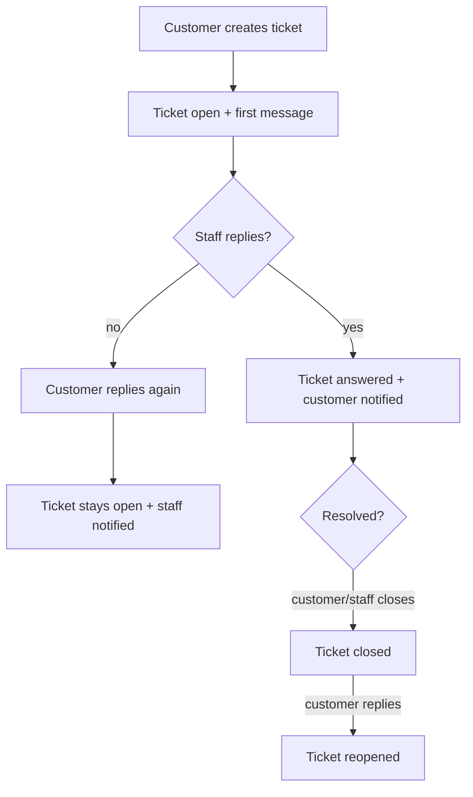

# 🧩 Support Module

## 🎯 Purpose
Customer support tickets: a customer opens a ticket about a question or
problem (optionally linked to one of their orders) and the conversation
unfolds as a thread of messages between the customer and staff.

## 📦 Responsibilities
- Customer-owned ticket lifecycle (`open` → `answered` → `closed`)
- Conversation messages per ticket (`customer` / `admin` senders)
- Optional, ownership-checked order reference per ticket
- Status rules: a staff reply marks the ticket `answered`; a customer
  reply always reopens a closed ticket; customers may only set
  `open` / `closed`

## 🗂 Tables
| Table | Description |
|----|----|
| support_tickets | One row per ticket: owner, subject, status, optional order_code, last_message_at |
| support_ticket_messages | Conversation messages: ticket, author, sender side, body |

## 🧠 Models
| Model | Description |
|----|----|
| Ticket | Base model (admin scope, all tickets) |
| User\Ticket | Customer-facing variant with the ownership global scope (UserScopeTrait) |
| TicketMessage | A single message in a ticket thread |

## 🔔 Events Emitted
| Event | When |
|----|----|
| Support.TicketCreated | Customer creates a ticket (first message included) |
| Support.TicketMessageCreated | Any reply; `sender` distinguishes customer/admin |
| Support.TicketStatusUpdated | Status changed by customer or staff |
| Support.TicketDeleted | Staff deletes a ticket |

## 👂 Events Listened To
| Event | Reaction |
|----|----|
| (none — module only emits) | |

The Notification module reacts to the ticket events: new ticket and
customer replies notify staff (database + email), staff replies notify
the customer (database + email + webpush) with `meta.ticket_id` for
deep-linking.

## 🔗 Dependencies
| Module | Reason |
|----|----|
| Core | Base classes, event contracts, gateway contracts, rate limiting utils |
| Order (gateway) | `OrderGatewayInterface::getOrder()` validates that a linked order_code belongs to the customer |
| User (gateway) | `UserGatewayInterface::getUserNamesByIds()` resolves customer names for admin views |
| Auth (gateway) | `AccessGatewayInterface::getUserEmailsByIds()` resolves customer emails |

## 🔄 Flow

