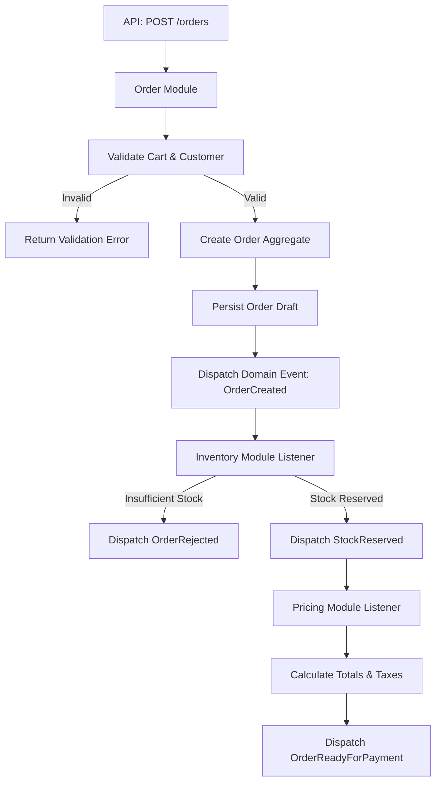

# Flows

## Order Placement

```mermaid
flowchart TD
    A[API: POST /orders] --> B[Order Module]
    
    B --> C[Validate Cart & Customer]
    C -->|Invalid| C1[Return Validation Error]

    C -->|Valid| D[Create Order Aggregate]
    D --> E[Persist Order Draft]

    E --> F[Dispatch Domain Event: OrderCreated]

    F --> G[Inventory Module Listener]
    G -->|Insufficient Stock| G1[Dispatch OrderRejected]
    G -->|Stock Reserved| H[Dispatch StockReserved]

    H --> I[Pricing Module Listener]
    I --> J[Calculate Totals & Taxes]

    J --> K[Dispatch OrderReadyForPayment]

```

## 
