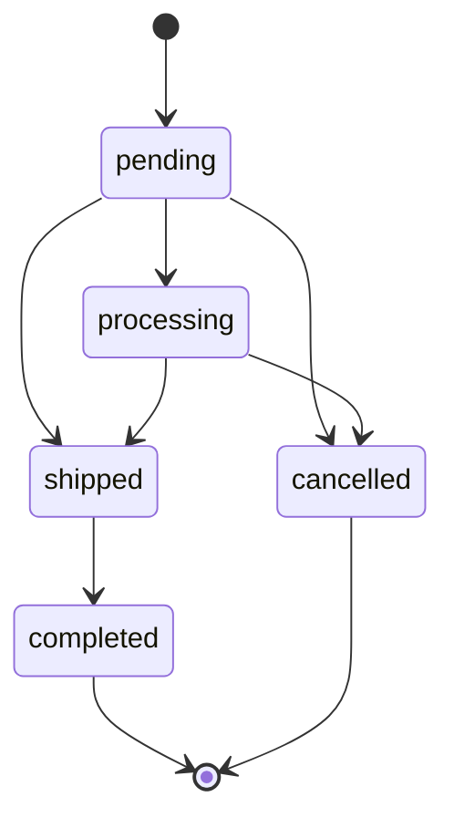
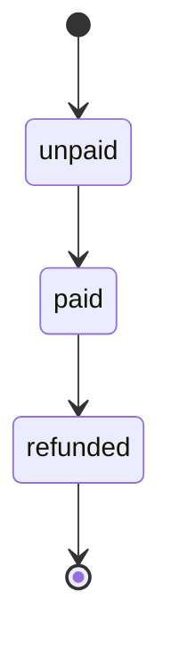

# Order State Machine

An order carries two independent status tracks: `status` (fulfillment) and `payment_status` (money). Every transition is guarded by `canTransitionTo()` on the owning enum; payment success additionally auto-advances fulfillment `pending → processing`.

## Fulfillment — `orders.status`

- `pending` → `processing`, `shipped`, `cancelled`
- `processing` → `shipped`, `cancelled`
- `shipped` → `completed`
- `completed`, `cancelled` — terminal

## Payment — `orders.payment_status`

- `unpaid` → `paid`
- `paid` → `refunded`
- `refunded` — terminal

## Lifecycle rules

- Checkout creates the order as `status=pending`, `payment_status=unpaid`, `expires_at=now()+30min`.
- Payment success (gateway webhook, admin payment confirm, or the admin order drawer) sets `payment_status=paid`, stamps `paid_at`, and auto-advances `pending → processing`. `OrderGateway::markAsPaid()` is idempotent — webhook retries for a settled order are no-ops.
- `order:cancel-expired` (every 5 minutes) cancels pending, unpaid orders past `expires_at` and dispatches `OrderCancelledEvent`, which restores reserved stock.
- `payment_payments.status` (`pending`/`success`/`failed`) tracks the individual transaction attempt and is a separate concept from the order-level `payment_status`.
