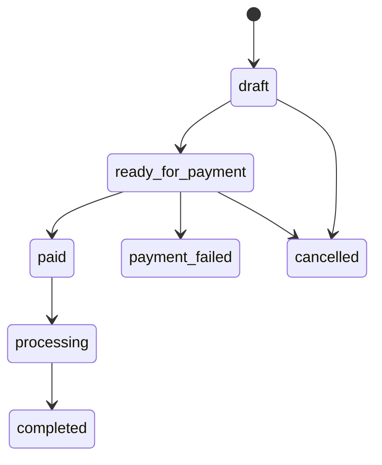

# Order State Machine (Must-have for Docs)

```mermaid
stateDiagram-v2
    [*] --> draft

    draft --> ready_for_payment
    ready_for_payment --> paid
    ready_for_payment --> payment_failed

    paid --> processing
    processing --> completed

    draft --> cancelled
    ready_for_payment --> cancelled

```
