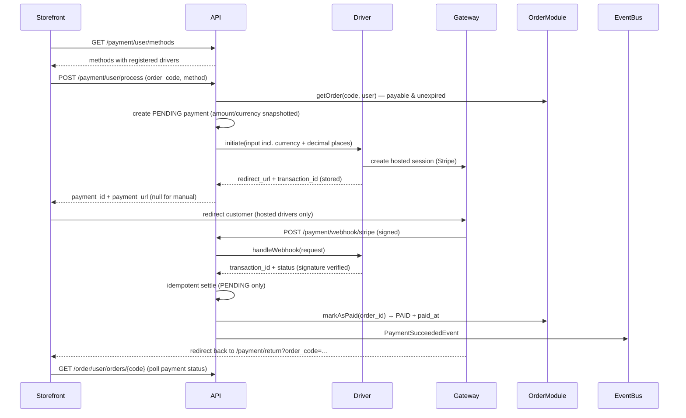

# Payment Flow (Sync by Default, Async-Capable)

Checkout and payment are two steps: checkout creates an UNPAID order
(expiring in 30 minutes), then a payment is started against its public
`order_code`.

## Drivers

Payment methods are a driver registry, not a table: `PaymentMethodEnum`
supplies the case, `config('payment.drivers')` maps it to a
`PaymentDriverInterface` implementation, and `PaymentDriverManager` resolves
it. A method is offerable only when it has a registered driver —
`GET /payment/user/methods` returns exactly that intersection and is the
storefront's source of truth for the checkout picker.

| Method | Driver | Flow |
| --- | --- | --- |
| `manual` | `ManualPaymentDriver` | No hosted checkout; an admin settles it (`PATCH /admin/payments/{id}`). |
| `stripe` | `StripePaymentDriver` | Hosted Checkout redirect; settled by signed webhook. |

## Sequence

The customer redirect is UX-only — settlement happens exclusively in the
webhook path, which is idempotent (replayed events for settled payments are
acked as no-ops).

## Stripe specifics

- `initiate` creates a Checkout Session (`mode=payment`, single `price_data`
  line item in minor units from the order currency's `decimal_places`,
  `metadata.payment_id/order_id`, `{order_code}`-templated success/cancel
  URLs). The session id (`cs_...`) is stored as `transaction_id`.
- `handleWebhook` verifies `Stripe-Signature` (HMAC over the raw body) and
  maps: `checkout.session.completed` with `payment_status=paid` and
  `async_payment_succeeded` → success; `async_payment_failed`/`expired` →
  failed; anything else → `payment.webhook.invalid`. A completed-but-unpaid
  session (deferred payment methods) is rejected so the payment stays
  PENDING until its terminal event.
- SDK access is wrapped in `StripeCheckout` so tests mock one class instead
  of the SDK's fluent service chain.

## Adding a payment driver

1. Add the case to `PaymentMethodEnum` (values are public API).
2. Implement `PaymentDriverInterface` (`initiate` + `handleWebhook`) under
   `Modules/Payment/app/Gateways/Drivers/`; verify the webhook signature
   inside `handleWebhook` and return the stored `transaction_id`.
3. Register it under its enum value in `Modules/Payment/config/payment.php`
   plus a config block for its env-driven credentials.
4. Point the gateway's webhook at `POST /api/v1/payment/webhook/{driver}` —
   `HandleWebhookAction` handles matching, idempotent settling, order
   `markAsPaid` and events generically.
5. Sync the storefront: extend `ApiPaymentMethod` in
   `lib/api/types.ts` and add checkout labels under
   `payment.methods.*` in `messages/{en,fa}/checkout/checkout.json`.
6. Cover the driver with unit tests (signature + event mapping) mirroring
   `StripePaymentDriverTest`.

Planned drivers follow the same recipe: **PayPal** (Orders v2 REST; capture
on the `CHECKOUT.ORDER.APPROVED` webhook so settlement stays webhook-driven)
and **Adyen** (hosted Payment Links; the link id doubles as
`transaction_id`, matched on the `AUTHORISATION` webhook's `pspReference`).
A Drop-in/Components integration would additionally need return-handling on
the driver contract.
