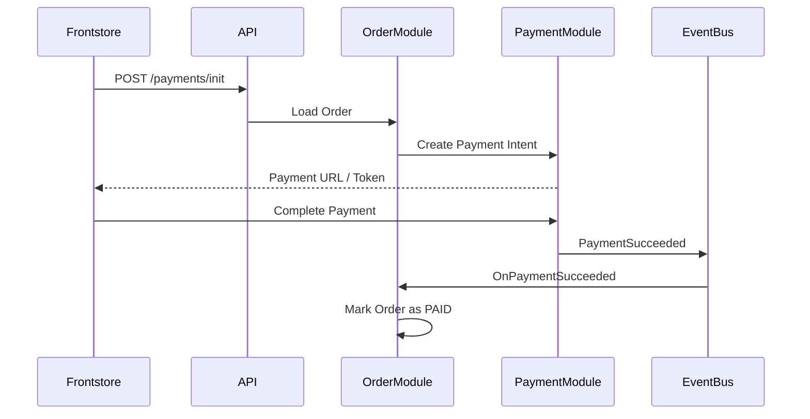

# Payment Flow (Sync by Default, Async-Capable)

```mermaid
sequenceDiagram
    participant Frontstore
    participant API
    participant OrderModule
    participant PaymentModule
    participant EventBus

    Frontstore->>API: POST /payments/init
    API->>OrderModule: Load Order
    OrderModule->>PaymentModule: Create Payment Intent

    PaymentModule-->>Frontstore: Payment URL / Token

    Frontstore->>PaymentModule: Complete Payment
    PaymentModule->>EventBus: PaymentSucceeded

    EventBus->>OrderModule: OnPaymentSucceeded
    OrderModule->>OrderModule: Mark Order as PAID

```
