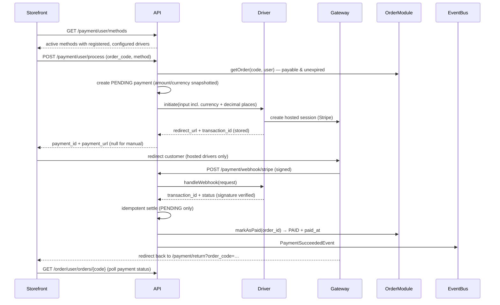

# Payment Flow (Sync by Default, Async-Capable)

Checkout and payment are two steps: checkout creates an UNPAID order
(expiring in 30 minutes), then a payment is started against its public
`order_code`.

## Drivers

Payment behavior is a driver registry: `PaymentMethodEnum` supplies the
case, `config('payment.drivers')` maps it to a `PaymentDriverInterface`
implementation, and `PaymentDriverManager` resolves it (and exposes
`isRegistered()` / `isConfigured()`).

Which methods customers see is state, not code: the `payment_methods`
table holds one row per method with `is_active` and `sort_order`, managed
by admins via `GET/PATCH /payment/admin/methods` (the list lazily creates
a disabled row for every registered driver, so a new gateway appears in
the admin without seeding; a method without a row counts as disabled).
A method is offerable only when its driver is registered **and**
configured (credentials present) **and** its row is active —
`GET /payment/user/methods` returns exactly that set, in the admin-set
order, and is the storefront's source of truth for the checkout picker.
`CreatePaymentAction` re-checks activation and rejects a disabled method
with `payment.process.method_inactive`, so a stale checkout page cannot
pay with a method an admin just turned off. Drivers also guard
themselves: a blank `payment.stripe.secret` (or webhook secret) throws
`payment.process.gateway_unconfigured` (HTTP 400) rather than surfacing an
SDK error as a 500.

| Method | Driver | Flow |
| --- | --- | --- |
| `manual` | `ManualPaymentDriver` | No hosted checkout; an admin settles it (`PATCH /admin/payments/{id}`). |
| `stripe` | `StripePaymentDriver` | Hosted Checkout redirect; settled by signed webhook. |
| `paypal` | `PaypalPaymentDriver` | Orders v2 hosted redirect; approved orders are captured on the webhook. |

## Sequence

```mermaid
sequenceDiagram
    participant Storefront
    participant API
    participant Driver
    participant Gateway
    participant OrderModule
    participant EventBus

    Storefront->>API: GET /payment/user/methods
    API-->>Storefront: active methods with registered, configured drivers
    Storefront->>API: POST /payment/user/process (order_code, method)
    API->>OrderModule: getOrder(code, user) — payable & unexpired
    API->>API: create PENDING payment (amount/currency snapshotted)
    API->>Driver: initiate(input incl. currency + decimal places)
    Driver->>Gateway: create hosted session (Stripe)
    Driver-->>API: redirect_url + transaction_id (stored)
    API-->>Storefront: payment_id + payment_url (null for manual)
    Storefront->>Gateway: redirect customer (hosted drivers only)

    Gateway->>API: POST /payment/webhook/stripe (signed)
    API->>Driver: handleWebhook(request)
    Driver-->>API: transaction_id + status (signature verified)
    API->>API: idempotent settle (PENDING only)
    API->>OrderModule: markAsPaid(order_id) → PAID + paid_at
    API->>EventBus: PaymentSucceededEvent

    Gateway-->>Storefront: redirect back to /payment/return?order_code=…
    Storefront->>API: GET /order/user/orders/{code} (poll payment status)
```

The customer redirect is UX-only — settlement happens exclusively in the
webhook path, which is idempotent (replayed events for settled payments are
acked as no-ops).

## Stripe specifics

- Requires `STRIPE_SECRET` and `STRIPE_WEBHOOK_SECRET` in the backend `.env`
  (see `.env.example`); without the former the method is hidden from
  `/payment/user/methods`, and direct calls fail with
  `payment.process.gateway_unconfigured`.
- `initiate` creates a Checkout Session (`mode=payment`, single `price_data`
  line item in minor units from the order currency's `decimal_places`,
  `metadata.payment_id/order_id`, `{order_code}`-templated success/cancel
  URLs). The session id (`cs_...`) is stored as `transaction_id`.
- `handleWebhook` verifies `Stripe-Signature` (HMAC over the raw body) and
  maps: `checkout.session.completed` with `payment_status=paid` and
  `async_payment_succeeded` → success; `async_payment_failed`/`expired` →
  failed; anything else → `payment.webhook.invalid`. A completed-but-unpaid
  session (deferred payment methods) is rejected so the payment stays
  PENDING until its terminal event.
- SDK access is wrapped in `StripeCheckout` so tests mock one class instead
  of the SDK's fluent service chain.

## PayPal specifics

- Requires `PAYPAL_CLIENT_ID` and `PAYPAL_CLIENT_SECRET` (plus
  `PAYPAL_MODE` — `sandbox` by default — and `PAYPAL_WEBHOOK_ID`) in the
  backend `.env` (see `.env.example`); without the credential pair the
  method is hidden from `/payment/user/methods`, and direct calls fail
  with `payment.process.gateway_unconfigured`.
- REST access is wrapped in the SDK-less `PaypalClient` (PayPal's PHP
  SDKs are deprecated): OAuth2 client-credentials token with cache on
  top of the Orders v2 API, so tests mock one class. PayPal order ids
  (`5O190…`) are alphanumeric — `payments.transaction_id` is a string.
- `initiate` creates an order (`intent=CAPTURE`, single purchase unit
  with `reference_id` = order code, `custom_id` = payment id, and a
  decimal-string `amount.value` built from the order currency's
  `decimal_places`; `{order_code}`-templated return/cancel URLs). The
  order id is stored as `transaction_id`, and the customer is sent to
  the response's `approve` link.
- `handleWebhook` first verifies the delivery through PayPal's
  `verify-webhook-signature` API (certificate-based over the `PAYPAL-*`
  transmission headers — unlike Stripe's HMAC there is no local check)
  and rejects anything the API does not confirm. Point the webhook at
  `POST /api/v1/payment/webhook/paypal` for `CHECKOUT.ORDER.APPROVED`,
  `PAYMENT.CAPTURE.COMPLETED`, `PAYMENT.CAPTURE.DENIED` and
  `CHECKOUT.PAYMENT-APPROVAL.REVERSED`.
- Redirect flows never auto-capture, so `CHECKOUT.ORDER.APPROVED` drives
  the capture: COMPLETED → success, DENIED/DECLINED → failed. The other
  terminal events map directly (capture events carry the stored order id
  at `resource.supplementary_data.related_ids.order_id`). PayPal retries
  non-2xx deliveries up to 25 times over 3 days, which is the guaranteed
  trigger: unexpected capture failures rethrow as 5xx so PayPal retries
  the whole webhook, while a replayed approval after settlement is acked
  via PayPal's `ORDER_ALREADY_CAPTURED` 422 instead of erroring until the
  retry cap.
- Local dev note: PayPal has no `stripe listen` equivalent — expose the
  backend through a tunnel (ngrok/cloudflared) and register that URL in
  the developer dashboard, or use the webhook simulator.

## Adding a payment driver

1. Add the case to `PaymentMethodEnum` (values are public API).
2. Implement `PaymentDriverInterface` (`initiate` + `handleWebhook`) under
   `Modules/Payment/app/Gateways/Drivers/`; verify the webhook signature
   inside `handleWebhook` and return the stored `transaction_id`.
3. Register it under its enum value in `Modules/Payment/config/payment.php`
   plus a config block for its env-driven credentials, and add the method to
   `PaymentDriverManager::isConfigured()` so it stays hidden until the
   credentials exist (throw `gatewayUnconfigured()` inside the driver as the
   backstop).
4. Point the gateway's webhook at `POST /api/v1/payment/webhook/{driver}` —
   `HandleWebhookAction` handles matching, idempotent settling, order
   `markAsPaid` and events generically.
5. Activate it: the new method appears in `GET /payment/admin/methods`
   (disabled) the first time an admin opens the page; flipping it active
   and ordering it there is all it takes — no seeding, no storefront
   deploy.
6. Sync the storefront: extend `ApiPaymentMethod` in
   `lib/api/types.ts` and add checkout labels under
   `payment.methods.*` in `messages/{en,fa}/checkout/checkout.json`.
7. Cover the driver with unit tests (signature + event mapping) mirroring
   `StripePaymentDriverTest`.

Planned drivers follow the same recipe: **Adyen** (hosted Payment Links;
the link id doubles as `transaction_id`, matched on the `AUTHORISATION`
webhook's `pspReference`). A Drop-in/Components integration would
additionally need return-handling on the driver contract.
