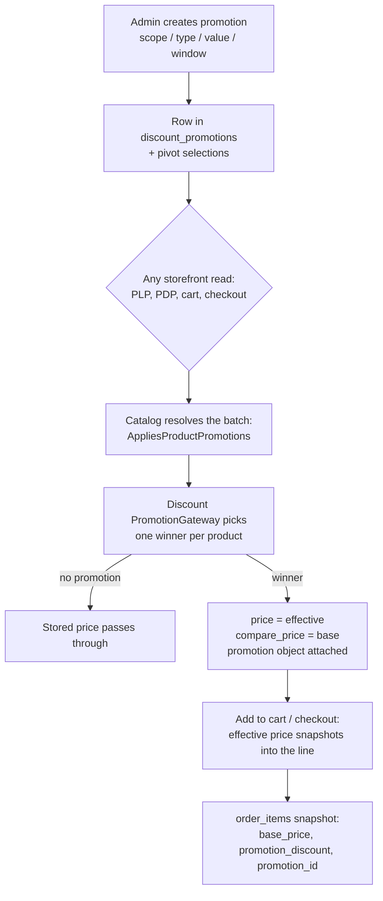

# Product Promotions — Price Resolution Flow

Automatic, code-less catalog price promotions live in `Modules/Discount`
alongside coupons. Coupons are **order-level** (a code the customer types at
checkout, stored on `orders`); promotions are **item-level** (they change a
product's price before it ever enters the cart, stored per `order_items`).
One winning promotion per product, one coupon per order — they compose.

## Life of a promotion

## Business rules

| Rule | Value |
| --- | --- |
| Scope | `all` (store-wide, pivots must stay empty) or `specific` (union of selected products ∪ selected categories; at least one selection required — an empty selection can never degrade to store-wide) |
| Precedence | product-pivot match > category-pivot match > store-wide; then `priority` desc; then lower id. One winner per product; promotions never stack with each other |
| Categories | exact selection only (no subtree) — category matches are equally specific, priority decides |
| Window | UTC, inclusive bounds; null start = immediate, null end = indefinite |
| Variants | the promotion attaches to the product; every variant is discounted on its own base price |
| Percent | per unit, half-up via `Money::applyPercent` (20.00 == 20%) |
| Fixed | per-unit major-unit amount, clamped at the base price — $40 off a $30 product discounts $30 and yields a free item, never a negative price |
| Money | stored decimal(12,2) major; computed in integer minor units; the applied discount persisted on order items is always the ACTUAL amount, never the configured value |
| `compare_price` | while promoted, `compare_price` = the original base price (the true pre-sale reference), superseding the merchant's static compare anchor |

## Cart / checkout pricing policy

The **current** effective price is authoritative — never the price frozen at
add-to-cart:

- Cart item **list responses** (user + guest) write-through refresh
  `price_snapshot` via `RefreshesCartPrices`, so cart and checkout pages
  always show today's price before the customer confirms.
- `CheckoutAction` re-resolves **inside its transaction**: cart lines are
  locked `lockForUpdate`, priced once in-memory, and that single resolution
  feeds the refreshed snapshots, the coupon's subtotal anchor and the
  order-item promotion facts. Order totals therefore equal the sum of their
  item snapshots by construction.
- Promotion rows are read **without locks**: a concurrent admin edit may
  interleave, but one checkout is always internally coherent.
- A price increase after add-to-cart is reflected (documented trade-off of
  the live-price policy).
- Coupons anchor to the promoted subtotal (Σ refreshed snapshots × qty) —
  unchanged code, documented stacking.

## Module boundaries

`PromotionGatewayInterface::resolveForProducts(productIds, categoryIdsByProduct)`
lives in Core and is implemented by Discount. The **caller supplies the
product→category map** (from eager loads or one batched pivot query), so the
Catalog → Discount resolution path is strictly one-directional — Discount
never calls back into Catalog while pricing. Discount → Catalog exists only
on the admin path, to validate scope id existence via
`CatalogGatewayInterface::productExists()/categoryExists()`.

Order history is self-contained: `order_items` snapshot `base_price`,
`promotion_discount` (actual per-unit amount) and `promotion_id` (plain id,
no FK), so hard-deleting a promotion never corrupts past invoices.
`price_snapshot` on the item remains the charged unit price; the invariant
`base_price − promotion_discount == price_snapshot` holds per promoted line.
